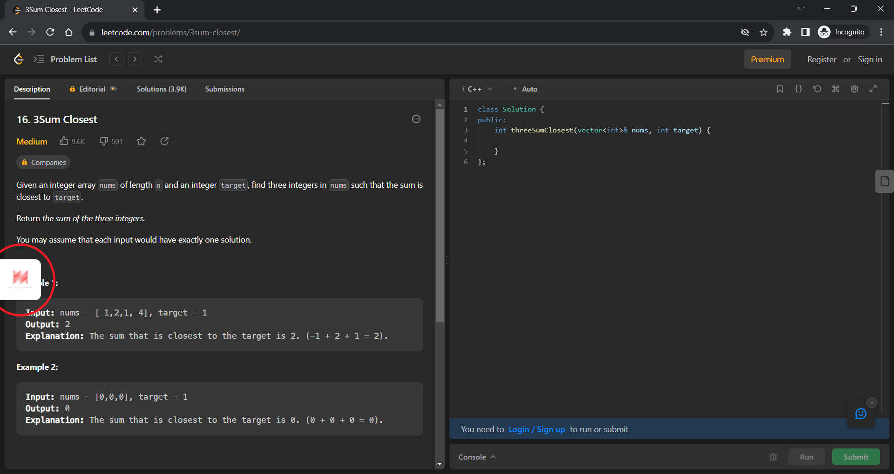

# Leetcode Extension

## Description
Leetcode Extension is a sidebar extension for chromium based browsers (e.g Google Chrome, microsoft edge etc.). 
The extension displays the list of companies that have asked a particular question on leetcode directly on the leetcode page.
This helps the user to get an idea of the companies that ask a particular question and prepare accordingly.

This extension also displays YouTube video solution for the on the sidebar.


>[!NOTE]
> * The extension is not yet published on chrome store because I am working on adding new features.
> * This project was part of Interview Prep Pro project. It is currently being developed separetly with its own custom API.

> [!IMPORTANT]
> * This extension fetches the companies list and youtube video solutions data from a custom made API.
> * The API is developed using `python(flask)`, `mongoDB` and `beautifulsoup4`(Scrape YouTube for video links).
> * I have not made the source code for the API public due to security reasons.


## TechStack
* Python - Flask, Beautifulsoup4
* Java Script
* HTML
* CSS

## Installation
1. Clone the repository
```bash
git clone https://github.com/saipraveenkondapalli/leetcode-extension.git
```
2. Open chrome browser and go to `chrome://extensions/`
3. Turn on the developer mode
4. Click on `Load unpacked` and select the cloned repository folder
5. The extension will be added to the browser and you can see the extension icon on the top right corner of the browser


## Demo

### Extension Icon


### Companies List in the sidebar


### YouTube video solutions in the sidebar

